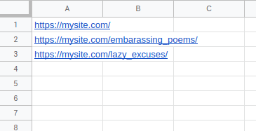
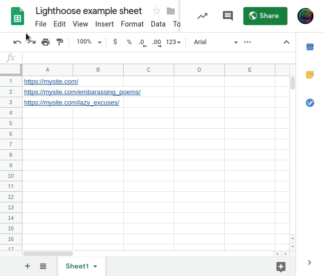

# Lighthoose! 💡🏠

This runs [Google Lighthouse][lh] against a dynamic list of URLs and saves the results in timestamped directories.

## Running Lighthoose

Lighthoose has two commands, `start` and `scan`.

 - `npm start` - launches a web server for browsing the scan results
 - `npm run scan` - fetches the URL list and scans each URL, saving results in the `reports/` directory

## Updating the URL List

Set an environment variable, `SHEET_URL` which points to a web-addressable text file with one URL per line.

    https://mysite.com/
    https://mysite.com/embarassing_poems/
    https://mysite.com/lazy_excuses/

Coincidentally, that's the same format as a CSV file with one URL per line (no
header), which allows Google Sheets to be used.  This can make it easier for
others to contribute to the URL list.

Your sheet will need to be published to the web, see [how to make a Google Sheet public](https://support.google.com/docs/answer/183965?co=GENIE.Platform%3DDesktop&hl=en), or just follow this recording.

Here's an example URL.

    export SHEET_URL=https://docs.google.com/spreadsheets/d/e/2PACX-1vTcmjE6MGq9MAKGkXuoe1lSZh7p825zRDTio1iFX34-BLNUsUylLCPd7Of5UW3v7rW42AUUcdFCEUl6/pub?output=csv

[lh]: https://developers.google.com/web/tools/lighthouse/
